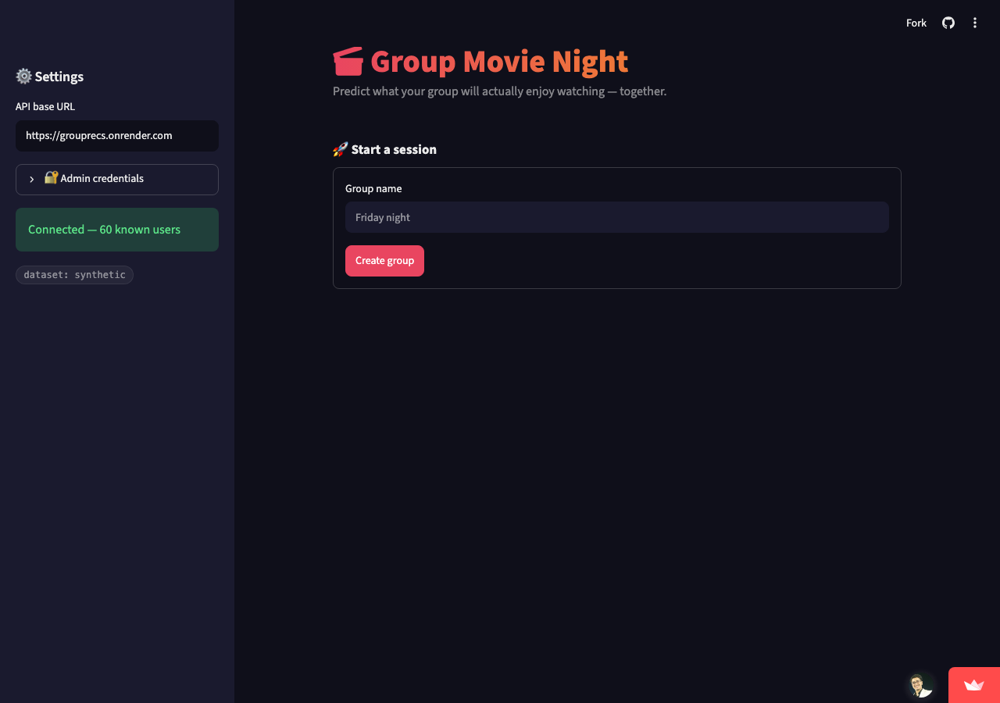
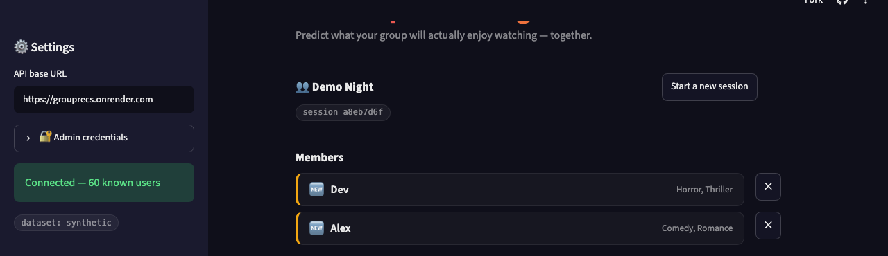
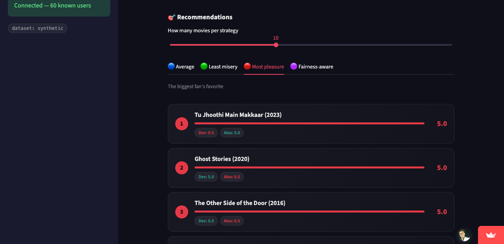

# 🎬 GroupRecs — Fair Group Movie Recommendation System

> **Recommending a movie for one person is easy. Recommending one that a whole group can agree on is the real challenge.**

GroupRecs is a **group movie recommendation system** designed for movie nights with multiple people.

Unlike traditional recommendation systems that optimize recommendations for a single user, GroupRecs predicts what **each member of a group** is likely to enjoy and then combines those predictions using different **group decision-making strategies**.

The system supports users with existing rating histories as well as **brand-new users with no historical data**, via two cold-start signals — genre preferences or demographics — usable separately or blended together.

---

## 🔗 Live Demo

- **App (Streamlit UI):** [priyamkeshri-grouprecs-app.streamlit.app](https://priyamkeshri-grouprecs-app.streamlit.app)
- **API (FastAPI backend):** [grouprecs.onrender.com](https://grouprecs.onrender.com) — interactive docs at [`/docs`](https://grouprecs.onrender.com/docs)

Viewing an existing group's recommendations is open to anyone with the link; creating a group or adding/removing members requires the admin password (see **Deployment** below). Render's free tier sleeps after 15 minutes idle, so the first request after a quiet period can take 30-60s to wake up.

---

## 📸 Screenshots

<p align="center">
  <br><br>
  <br><br>
  
</p>

The third screenshot is the whole point of the project in one image: under the **Most pleasure** strategy, *Tu Jhoothi Main Makkaar* scores Dev 0.5 (red) and Alex 5.0 (green) — a pick that thrills one person and would annoy the other. Switch to **Average** or **Fairness-aware** and the ranking changes to favor a pick both of them are reasonably happy with instead.

---

## ✨ Features

- 🎯 Personalized movie rating prediction
- 🧠 Matrix Factorization implemented from scratch
- ⚡ Stochastic Gradient Descent (SGD) optimization
- 🆕 Cold-start recommendation for new users — genre-based, demographic-based, or both blended
- 🎭 Genre-based preference profiling
- 👥 Demographic-based profiling (age / gender / occupation → "people like you" averaging)
- 👥 Group-aware movie recommendation
- ⚖️ Multiple social-choice aggregation strategies
- 📊 Comparison of different group recommendation strategies
- 🧪 Synthetic MovieLens-like data generation (no download required to try it)
- 🎬 Support for MovieLens 100K, 1M, and 25M — biggest downloaded dataset is used automatically
- 🇮🇳 Bundled Bollywood catalog (2,199 titles, 1951-2023) merged in automatically
- 💾 Trained-model disk cache — skips retraining on restart when nothing's changed
- 🌐 FastAPI backend with interactive Swagger docs
- 🖥️ Streamlit "group room" UI
- 🧩 Modular recommendation pipeline using NumPy and Pandas

---

# 🧠 Problem Statement

Traditional recommendation systems usually answer:

> **"What movie should I recommend to this user?"**

However, movie nights typically involve multiple people.

For example:

```text
Alice → Loves Comedy & Romance
Bob   → Loves Action & Thriller
Chloe → Loves Drama
Dev   → Loves Horror & Thriller
```

A movie that Alice loves might be terrible for Dev.

Therefore, simply recommending the highest-rated movie for one person is not enough.

GroupRecs approaches this as a **group decision-making problem**.

The system follows this pipeline:

```text
Individual Preferences
          │
          ▼
┌──────────────────────┐
│ Individual Prediction│
│       Models         │
└──────────┬───────────┘
           │
           ▼
    Predicted Ratings
           │
           ▼
┌──────────────────────┐
│ Group Aggregation    │
│                      │
│ • Average            │
│ • Least Misery       │
│ • Most Pleasure      │
│ • Fairness-Aware     │
└──────────┬───────────┘
           │
           ▼
      Group Ranking
           │
           ▼
      🎬 Movie Night
```

---

# 🚀 How It Works

GroupRecs consists of three major stages:

1. **Individual Recommendation**
2. **Cold-Start Recommendation**
3. **Group Preference Aggregation**

## 1. 🎯 Individual Recommendation

For users with historical ratings, GroupRecs uses **Matrix Factorization** to learn latent representations of users and movies.

The predicted rating is modeled as:

```text
rating(u, i) =
    global_mean
    + user_bias
    + item_bias
    + user_factors · item_factors
```

The model is trained using **Stochastic Gradient Descent (SGD)** with L2 regularization.

The matrix factorization implementation is built **from scratch using NumPy**, rather than relying on a dedicated recommendation-system library.

## 2. 🆕 Cold-Start Recommendation

Traditional collaborative filtering struggles when a user has no rating history.

This is known as the **cold-start problem**. GroupRecs handles new users with two lightweight signals — either alone, or blended together for a stronger prediction:

**Genre-based.** Instead of requiring a new user to rate many movies, they can simply select genres they enjoy:

```text
User Preferences

✓ Comedy
✓ Romance
```

The system builds a genre preference vector and compares it with each movie's genre vector using **cosine similarity**, converted into a predicted rating.

**Demographic-based.** The user gives age / gender / occupation instead, and gets a prediction averaged from the ratings of similar existing users ("people like you"), falling back through progressively coarser peer groups when the exact group is too small to trust.

This allows completely new users to participate in group recommendations immediately, with no rating history required.

---

# 📊 Group Strategy Comparison

| Strategy | Objective | Behavior |
|----------|-----------|-----------|
| `average` | Overall satisfaction | Balances everyone's predicted ratings |
| `least_misery` | Avoid strong dislike | Protects the least satisfied member |
| `most_pleasure` | Maximum enthusiasm | Favors the strongest individual preference |
| `fairness_aware` | Satisfaction + fairness | Penalizes large disagreements |

> **There is no universally "best" group recommendation strategy.**

Different strategies optimize different objectives.

---

# 📦 Installation

Clone the repository:

```bash
git clone https://github.com/PriyamKeshri/GroupRecs.git
cd GroupRecs
```

Create a virtual environment.

### macOS / Linux

```bash
python3 -m venv .venv
source .venv/bin/activate
```

### Windows

```bash
python -m venv .venv
.venv\Scripts\activate
```

Install dependencies:

```bash
pip install -r requirements.txt
```

---

# ▶️ Running the Project

**Console demo** — trains (or loads a cached model for) the biggest dataset you've downloaded and walks through a full group recommendation end to end:

```bash
python3 demo.py
```

**API + UI** — the full FastAPI backend + Streamlit "group room" together, one command:

```bash
./run.sh
```
Then open http://localhost:8501 for the UI, or http://localhost:8000/docs for the API's interactive Swagger docs.

If you're actively editing `src/api.py` and want hot-reload, run the two pieces in separate terminals instead:
```bash
python3 -m uvicorn src.api:app --reload --port 8000     # terminal 1
streamlit run streamlit_app.py                          # terminal 2
```

---

# 🗂️ Dataset

Works out of the box with a synthetic MovieLens-like generator — no download needed. For real data, download whichever tier you want into `data/`; the biggest one present is used automatically (25M → 1M → 100k → synthetic):

```bash
# ~1,700 movies / 943 users / 100k ratings
curl -L -o /tmp/ml-100k.zip https://files.grouplens.org/datasets/movielens/ml-100k.zip
unzip /tmp/ml-100k.zip -d data/

# ~3,900 movies / 6,040 users / 1M ratings
curl -L -o /tmp/ml-1m.zip https://files.grouplens.org/datasets/movielens/ml-1m.zip
unzip /tmp/ml-1m.zip -d data/

# ~62,000 movies (titles up to 2019) / 25M ratings
curl -L -o /tmp/ml-25m.zip https://files.grouplens.org/datasets/movielens/ml-25m.zip
unzip /tmp/ml-25m.zip "ml-25m/movies.csv" "ml-25m/ratings.csv" -d data/
```

The 25M dataset has no real demographic data (GroupLens stopped collecting it after the 1M release) — demographics are synthesized for it so the demographic cold-start path still works, just not against real peer data. Check `GET /health` or the Streamlit sidebar to see which dataset and demographic source are active.

**Bollywood catalog** (`data/bollywood/movies.csv`, [source](https://github.com/devensinghbhagtani/Bollywood-Movie-Dataset)) is bundled in the repo and merges automatically on top of whichever base dataset is active — 2,199 Hindi-cinema titles (1951-2023) with real genre data. Unlike the MovieLens tiers, no per-user ratings exist for these movies anywhere (every Bollywood dataset we found is IMDb/Wikipedia metadata, not a ratings log), so:
- Genre-based cold-start guests get full, personalized Bollywood recommendations
- Existing/collaborative-filtering users get an unpersonalized (global-mean) score for these titles specifically, same fallback the model already uses for any movie a user has no rating signal on

Because genre-based scoring is coarse (cosine similarity over one-hot genre vectors), broad multi-genre preferences often produce large tied-score groups spanning both catalogs — a Bollywood title can be mathematically tied for the #1 spot yet not appear in a small `top_n` slice if enough base-dataset movies share that same tie. Use a larger `top_n` or more specific genre picks to see more Bollywood variety.

---

# ☁️ Deployment

Both pieces are normal long-running servers (in-memory group state, no external database), so they need a host that keeps a process alive — not a serverless/edge platform. Free split that works well:

**API on [Render](https://render.com):**
1. New → Web Service → connect this repo
2. Build command: `pip install -r requirements.txt`
3. Start command: `uvicorn src.api:app --host 0.0.0.0 --port $PORT`
4. Plan: Free
5. Environment → add `AUTH_USERNAME` and `AUTH_PASSWORD` (pick your own values — these gate group creation and adding/removing members so a public link isn't editable by anyone who finds it; without them the API falls back to the placeholder `admin`/`changeme`, which is fine for local dev but not for a public deployment)

Downloaded datasets aren't in the repo (see `.gitignore`), so the deployed API automatically falls back to the synthetic generator — fast to train, no extra setup needed on first boot.

**UI on [Streamlit Community Cloud](https://share.streamlit.io):**
1. New app → connect this repo → main file path `streamlit_app.py`
2. In the app's Settings → Secrets, add:
   ```toml
   API_BASE_URL = "https://<your-render-service>.onrender.com"
   AUTH_USERNAME = "<same value you set on Render>"
   AUTH_PASSWORD = "<same value you set on Render>"
   ```
   (`streamlit_app.py` reads these automatically — see `_default_api_url()` / `_default_admin_credentials()` — so visitors don't have to paste the API URL in themselves, and you don't have to retype your own admin password every visit. `AUTH_USERNAME`/`AUTH_PASSWORD` here are just a convenience default for the sidebar fields, not a separate secret store — anyone you want to let create/edit groups still needs the actual password, typed into the sidebar's "Admin credentials" section.)

**Who can do what on the deployed app:** anyone with the link can view an existing group's recommendations (`GET` endpoints are open). Creating a group or adding/removing members requires the admin username/password (`POST`/`DELETE` endpoints require it) — enter it once in the sidebar's "Admin credentials" expander.

Render's free tier sleeps after 15 minutes idle and takes ~30-60s to wake on the next request — expected on a free plan, not a bug.

---

# 📄 License

[MIT](LICENSE) — free to use, modify, and distribute.

---

# 👨‍💻 Author

### Priyam Keshri


# ⭐ Support

If you found this project interesting or useful, consider giving the repository a ⭐.

---

<p align="center">
  <b>🎬 One movie. Multiple preferences. One group decision.</b>
</p>
