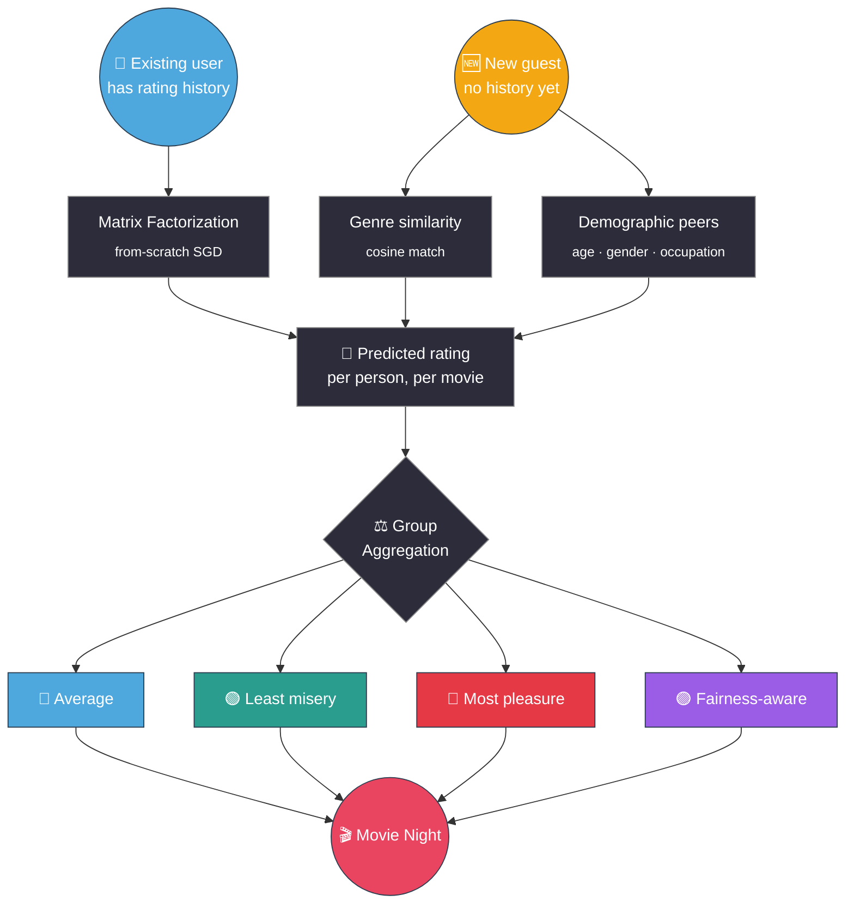

<div align="center">

# 🎬 GroupRecs

**Recommending a movie for one person is easy. Recommending one that a whole group can agree on is the real challenge.**

[](LICENSE)
[](https://www.python.org/)
[](https://fastapi.tiangolo.com/)
[](https://streamlit.io/)

[**Live App**](https://priyamkeshri-grouprecs-app.streamlit.app) · [**Live API Docs**](https://grouprecs.onrender.com/docs) · [Quick Start](#-quick-start) · [How It Works](#-how-it-works)

</div>

---

Most recommender systems answer one question: *"What will this one person like?"* GroupRecs answers a harder one: **what will a whole group of people, with different tastes, actually enjoy watching together?**

It predicts what each member of a group would individually rate every candidate movie, then combines those predictions using different **group decision-making strategies** — and lets you compare how the "best" pick changes depending on what you optimize for. It also handles brand-new guests with **no rating history at all**, so nobody has to rate 20 movies before joining a group.

<p align="center">
  
</p>

<p align="center"><sub>Under <b>Most pleasure</b>, <i>Tu Jhoothi Main Makkaar</i> scores Dev 0.5 (red) and Alex 5.0 (green) — a pick that thrills one person and would annoy the other. Switch to <b>Average</b> or <b>Fairness-aware</b> and the ranking shifts to favor something both are reasonably happy with instead. That shift, on demand, is the whole point of the project.</sub></p>

<table align="center">
  <tr>
    <td></td>
    <td></td>
  </tr>
</table>

---

## ✨ Features

- 🧠 Matrix factorization recommender, implemented **from scratch** with NumPy (no `surprise`/`implicit`)
- 🆕 Cold-start for new users — genre-based, demographic-based, or both blended — no rating history required
- ⚖️ Four group aggregation strategies (`average`, `least_misery`, `most_pleasure`, `fairness_aware`), compared side by side
- 🎬 MovieLens 100K / 1M / 25M support — biggest downloaded dataset is used automatically, synthetic data if none are
- 🇮🇳 Bundled Bollywood catalog (2,199 titles, 1951–2023), merged in automatically
- 💾 Trained-model disk cache — skips retraining on restart when nothing's changed
- 🌐 FastAPI backend with interactive Swagger docs, HTTP Basic Auth on all write operations
- 🖥️ Streamlit "group room" UI

---

## 🧠 How It Works



**Existing users** get predictions from a matrix factorization model trained with stochastic gradient descent:

```
rating(user, movie) = global_mean + user_bias + item_bias + user_factors · item_factors
```

**Brand-new guests** skip straight to a prediction via one of two lightweight signals, usable separately or blended:
- **Genre-based** — pick a few favorite genres; scored by cosine similarity against each movie's genre vector
- **Demographic-based** — give age / gender / occupation; scored by averaging ratings from similar existing users, falling back to progressively broader peer groups when the exact match is too small to trust

### Group strategies

| Strategy | Optimizes for | Behavior |
|---|---|---|
| 🔵 `average` | Overall satisfaction | Balances everyone's predicted ratings |
| 🟢 `least_misery` | No one hates the pick | Protects the least satisfied member |
| 🔴 `most_pleasure` | Maximum enthusiasm | Favors the single strongest preference |
| 🟣 `fairness_aware` | Satisfaction + fairness | Penalizes picks the group disagrees on |

There's no universally "best" strategy — each optimizes for something different, which is exactly why the app shows all four at once (colors above match the strategy tabs in the app).

---

## 🚀 Quick Start

```bash
git clone https://github.com/PriyamKeshri/GroupRecs.git
cd GroupRecs
python3 -m venv .venv && source .venv/bin/activate   # Windows: .venv\Scripts\activate
pip install -r requirements.txt
```

**Console demo** — trains (or loads a cached model for) the biggest dataset you've downloaded and walks through a full group recommendation end to end:
```bash
python3 demo.py
```

**API + UI together, one command:**
```bash
./run.sh
```
Then open `http://localhost:8501` for the UI, or `http://localhost:8000/docs` for the API's interactive Swagger docs.

Actively editing `src/api.py`? Run the two pieces separately for hot-reload:
```bash
python3 -m uvicorn src.api:app --reload --port 8000     # terminal 1
streamlit run streamlit_app.py                          # terminal 2
```

---

## 🗂️ Dataset

Works out of the box with a synthetic MovieLens-like generator — no download needed. For real data, download whichever tier you want into `data/`; the biggest one present is used automatically (25M → 1M → 100K → synthetic):

```bash
# ~1,700 movies / 943 users / 100k ratings
curl -L -o /tmp/ml-100k.zip https://files.grouplens.org/datasets/movielens/ml-100k.zip
unzip /tmp/ml-100k.zip -d data/

# ~3,900 movies / 6,040 users / 1M ratings
curl -L -o /tmp/ml-1m.zip https://files.grouplens.org/datasets/movielens/ml-1m.zip
unzip /tmp/ml-1m.zip -d data/

# ~62,000 movies (titles up to 2019) / 25M ratings
curl -L -o /tmp/ml-25m.zip https://files.grouplens.org/datasets/movielens/ml-25m.zip
unzip /tmp/ml-25m.zip "ml-25m/movies.csv" "ml-25m/ratings.csv" -d data/
```

The 25M dataset has no real demographic data (GroupLens stopped collecting it after the 1M release) — demographics are synthesized for it so the demographic cold-start path still works, just not against real peer data. Check `GET /health` or the Streamlit sidebar to see which dataset and demographic source are active.

**Bollywood catalog** (`data/bollywood/movies.csv`, [source](https://github.com/devensinghbhagtani/Bollywood-Movie-Dataset)) is bundled in the repo and merges automatically on top of whichever base dataset is active. No per-user ratings exist for these titles anywhere, so genre-based guests get full personalized recommendations for them, while collaborative-filtering users get an unpersonalized average score — the same fallback used for any movie they have no rating signal on.

---

## ☁️ Deployment

Both pieces are normal long-running servers (in-memory group state, no database), so they need a host that keeps a process alive — not a serverless/edge platform.

**API on [Render](https://render.com):** New → Web Service → connect this repo
- Build: `pip install -r requirements.txt`
- Start: `uvicorn src.api:app --host 0.0.0.0 --port $PORT`
- Environment: add `AUTH_USERNAME` / `AUTH_PASSWORD` — these gate group creation and member add/remove so a public link isn't editable by anyone who finds it

**UI on [Streamlit Community Cloud](https://share.streamlit.io):** New app → connect this repo → main file `streamlit_app.py`
- Settings → Secrets:
  ```toml
  API_BASE_URL = "https://<your-render-service>.onrender.com"
  AUTH_USERNAME = "<same value as Render>"
  AUTH_PASSWORD = "<same value as Render>"
  ```

Anyone with the link can view a group's recommendations; creating a group or adding/removing members needs the admin password, entered once in the sidebar's "Admin credentials" section. Render's free tier sleeps after 15 minutes idle — the first request after that takes 30-60s to wake up.

---

<div align="center">

Made by [Priyam Keshri](https://github.com/PriyamKeshri) · [MIT License](LICENSE) · if this was useful, a ⭐ is appreciated

**🎬 One movie. Multiple preferences. One group decision.**

</div>
